<a href="https://nurettincoban.github.io/">
  <picture>
    <source media="(prefers-color-scheme: dark)" srcset="assets/banner-dark-v2.svg">
    
  </picture>
</a>

  
  
  
  

**[ai-prd-workflow](https://github.com/nurettincoban/ai-prd-workflow)** — RFC-driven development for AI coding agents. 
**[diff2ai](https://github.com/nurettincoban/diff2ai)** — AI code reviews from your Git diffs, local and repo-safe.
