<a href="https://nurettincoban.github.io/">
  <picture>
    <source media="(prefers-color-scheme: dark)" srcset="assets/banner-dark.svg">
    
  </picture>
</a>

  
  
  
  
  
  
  

💼 **Senior Software Engineer at Virta** — 12+ years in backend and distributed systems 
⚡ **EV charging platforms** — OCPP, OCPI, ISO 15118 Plug & Charge, across Europe 
✨ **Open-source AI tooling** — helping coding agents build the *right* thing, not just build things fast 
📍 **Helsinki, Finland** — English, Turkish, some Finnish

### Projects
Open source, mostly tools for AI coding agents

**[ai-prd-workflow](https://github.com/nurettincoban/ai-prd-workflow)** &nbsp; 
RFC-driven development for AI coding agents: an idea, or a codebase that already exists, becomes a verified PRD, prioritised features, project rules and small RFCs in dependency order — then gets implemented and reviewed one RFC at a time. A Claude Code plugin and Agent Skills for Codex, Copilot, Cursor, Gemini CLI, OpenCode and Devin, supported by Anthropic through its open source program.

**[diff2ai](https://github.com/nurettincoban/diff2ai)** &nbsp; 
Turns your Git diffs into high-signal AI code reviews — fast, local, and repo-safe.

### Music
Music producer, as NUO

**Ad Astra** · NUO · Soundtype · 2023 
Debut single: deep bass, atmospheric pads and a synth line that climbs toward the stars. On [the website](https://nurettincoban.github.io/), drawing in the stars plays it. 
[Listen on Spotify](https://open.spotify.com/track/0aJGy8y6adeTeD7F0crBIW) · [All tracks](https://open.spotify.com/artist/51cQ2Nmn14MVBDEQ7j4gst) · [Featured in Mixmag Turkey](https://mixmag.com.tr/read/nuo-ad-astra-news)

 

### Experience
13 years, four companies, three countries

**Virta** · 2020 — now · Helsinki — Senior Software Engineer. The EV charging platform behind thousands of stations across Europe; as Tech Lead & Interim Team Lead (2024–26), ISO 15118 Plug & Charge end to end, and card payments on chargers. 
**Devolon** · 2018 — 20 · Estonia — Led the ordering platform for a Finnish restaurant chain: in-store and takeaway orders, payments, and the kitchen screen. 
**Safee Fleet Management** · 2017 — 18 — Real-time map dashboards tracking 10,000+ vehicles. 
**Metanet Group** · 2013 — 16 · Gaziantep — Kiosk apps, enterprise tools, and field software for solar energy teams.

### Writing
Notes on building software with AI

[The State of Agentic Coding: Transforming Software Development with AI](https://medium.com/@nurettinc/the-state-of-agentic-coding-transforming-software-development-with-ai-09c0447c254d) — on Medium
